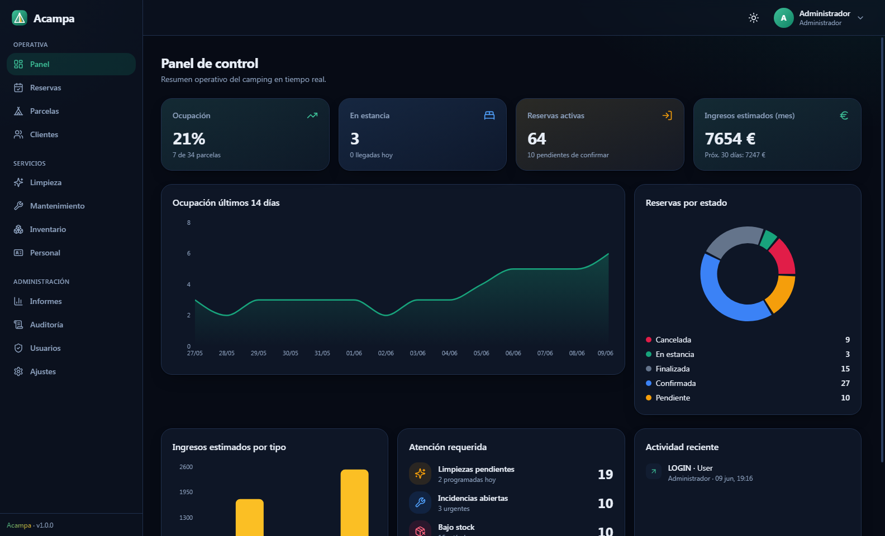
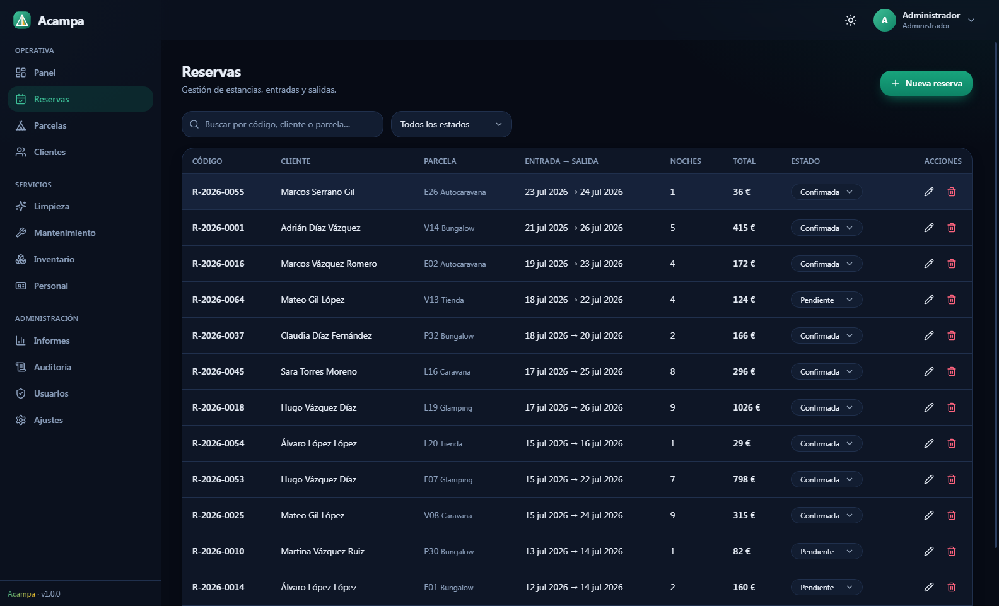
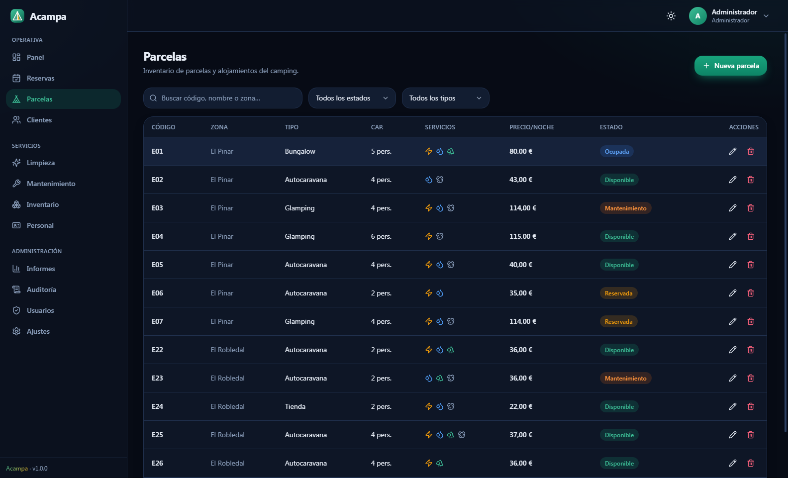
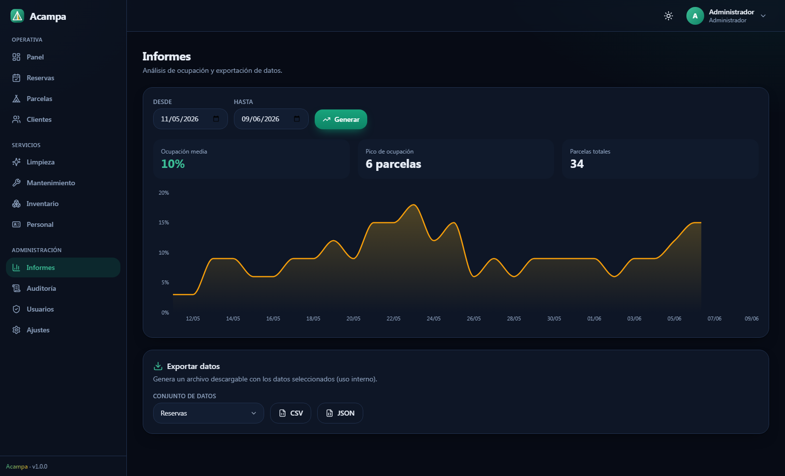

# 🏕️ Acampa

### Software profesional de gestión de campings

**Reservas · Parcelas · Clientes · Limpieza · Mantenimiento · Inventario · Informes**

Una sola aplicación de escritorio para toda la operativa de tu camping. Rápida, local y sin depender de internet.

🌐 **[Ver la demo →](https://svetoslav1999.github.io/acampa/)**

---

## ¿Qué es Acampa?

**Acampa** es una aplicación de **escritorio** que centraliza la gestión diaria de un camping en una única herramienta: desde la recepción hasta la dirección. Sustituye los cuadernos, las hojas de cálculo dispersas y las llamadas por una **única fuente de verdad** compartida por todo el equipo.

Funciona **100% en local**: los datos viven en el propio equipo, sin conexión a internet ni cuotas mensuales por la nube.

## ¿Qué problema resuelve?

Gestionar un camping con Excel y papel genera errores caros: dobles reservas, parcelas sin preparar, stock que se agota sin avisar y falta de visión global. Acampa **elimina esos puntos de fricción**:

- ❌ **Sin dobles reservas** — el sistema impide reservar dos veces la misma parcela en las mismas fechas.
- 🧹 **Servicios coordinados** — limpieza y mantenimiento con prioridades claras y asignación al personal.
- 📦 **Inventario bajo control** — alertas automáticas cuando un producto baja del mínimo.
- 📊 **Visión global** — KPIs de ocupación e ingresos, informes y auditoría de todo lo que ocurre.

## Público objetivo

- **Campings** pequeños y medianos que quieren profesionalizar su operativa.
- **Recepción** — gestión ágil de reservas, llegadas y salidas.
- **Equipos de servicios** — limpieza y mantenimiento organizados.
- **Dirección** — control total con datos en tiempo real.

## Funcionalidades

| Módulo | Qué hace |
|---|---|
| 📊 **Panel de control** | KPIs en vivo: ocupación, ingresos estimados, llegadas y salidas + gráficas. |
| 📅 **Reservas** | Cálculo automático de noches y total, control de solapamientos, estados guiados. |
| ⛺ **Parcelas** | Catálogo por tipo, servicios, precio por noche y estado. |
| 👥 **Clientes** | Directorio con contacto, ubicación e historial de reservas. |
| ✨ **Limpieza** | Tareas por parcela, asignación al personal y prioridades. |
| 🔧 **Mantenimiento** | Incidencias con categoría, prioridad, coste y seguimiento. |
| 📦 **Inventario** | Stock con mínimos, alertas y movimientos (entrada/salida/ajuste). |
| 📈 **Informes** | Ocupación por fechas y exportación a CSV / JSON. |
| 🛡️ **Auditoría y usuarios** | Registro de acciones y roles (Administrador, Responsable, Personal). |

## Beneficios

- **Funciona sin internet.** Tus datos, en tu equipo.
- **Rápido y nativo.** Abre con doble clic, sin navegadores ni configuraciones.
- **Modo claro y oscuro.** Cómodo a cualquier hora.
- **Pensado para equipos.** Roles y permisos por perfil.
- **Privado por diseño.** No procesa pagos ni almacena documentos de identidad.

## Capturas reales

> Pantallas reales de la aplicación funcionando con datos de ejemplo. Vista interactiva completa en **[svetoslav1999.github.io/acampa](https://svetoslav1999.github.io/acampa/)**

### Panel de control

### Reservas

### Parcelas

### Informes

---

¿Quieres una demostración? **[hola@acampa.app](mailto:hola@acampa.app)**

© 2026 Acampa · Software de gestión de campings

> Este repositorio contiene únicamente la **página de presentación** de Acampa.
> El producto es software propietario; el código fuente no es público.
