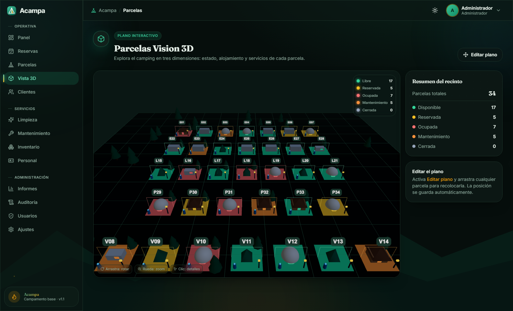
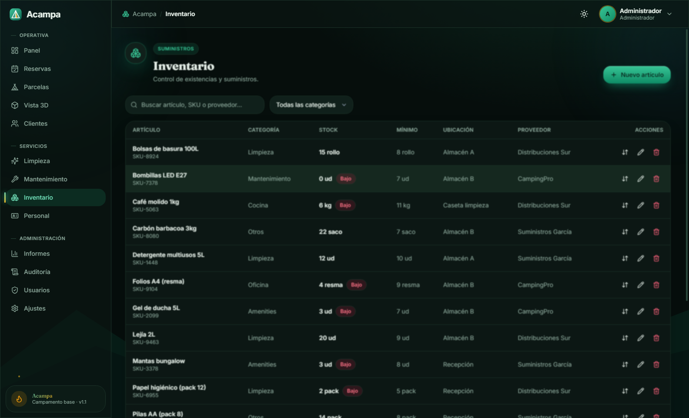

# 🏕️ Acampa

### Software profesional de gestión de campings

**Reservas · Parcelas · Clientes · Limpieza · Mantenimiento · Inventario · Informes · Vista 3D**

Una sola aplicación de escritorio para toda la operativa de tu camping.
Rápida, **100 % local** y con una **vista 3D** navegable de tu instalación.

🌐 **[Abrir la demo interactiva →](https://svetoslav1999.github.io/acampa/)**

---

## ¿Qué es Acampa?

**Acampa** es una aplicación de **escritorio** que centraliza la gestión diaria de un camping en una única herramienta: desde la recepción hasta la dirección. Sustituye los cuadernos, las hojas de cálculo dispersas y las llamadas por una **única fuente de verdad** compartida por todo el equipo.

Funciona **100 % en local**: los datos viven en el propio equipo, sin conexión a internet ni cuotas mensuales por la nube.

## ¿Qué problema resuelve?

Gestionar un camping con Excel y papel genera errores caros: dobles reservas, parcelas sin preparar, stock que se agota sin avisar y falta de visión global. Acampa **elimina esos puntos de fricción**:

- ❌ **Sin dobles reservas** — el sistema impide reservar dos veces la misma parcela en las mismas fechas.
- 🧹 **Servicios coordinados** — limpieza y mantenimiento con prioridades claras y asignación al personal.
- 📦 **Inventario bajo control** — alertas automáticas cuando un producto baja del mínimo.
- 📊 **Visión global** — KPIs de ocupación e ingresos, informes y auditoría de todo lo que ocurre.
- 🗺️ **Vista 3D del camping** — una maqueta navegable con cada parcela coloreada por estado.

## Público objetivo

- **Campings** pequeños y medianos que quieren profesionalizar su operativa.
- **Áreas de autocaravanas** que necesitan control de parcelas y rotación.
- **Recepción** — gestión ágil de reservas, llegadas y salidas.
- **Equipos de servicios** — limpieza y mantenimiento organizados.
- **Dirección** — control total con datos en tiempo real.

---

## ✨ Novedad: Parcelas Vision 3D

La vista **Parcelas Vision 3D** dibuja tu camping como una **maqueta navegable**:

- 🎨 Cada parcela se **colorea según su estado**: libre, ocupada, reservada o en servicio.
- ⛺ Los alojamientos se representan **por tipo**: tienda, caravana, bungaló y más.
- 🖱️ **Arrastra para colocar** cada parcela; la posición queda guardada automáticamente.
- 🔄 **Órbita, zoom y vista cenital** con controles de cámara fluidos.

---

## Funcionalidades

| Módulo | Qué hace |
|---|---|
| 📊 **Panel de control** | KPIs en vivo: ocupación, ingresos estimados, llegadas y salidas + gráficas. |
| 📅 **Reservas** | Cálculo automático de noches y total, control de solapamientos, estados guiados. |
| ⛺ **Parcelas** | Catálogo por tipo, servicios, precio por noche y estado. |
| 🗺️ **Vista 3D** | Maqueta 3D del camping con parcelas por estado y alojamientos por tipo. |
| 👥 **Clientes** | Directorio con contacto, ubicación e historial de reservas. |
| ✨ **Limpieza** | Tareas por parcela, asignación al personal y prioridades. |
| 🔧 **Mantenimiento** | Incidencias con categoría, prioridad, coste y seguimiento. |
| 📦 **Inventario** | Stock con mínimos, alertas y movimientos (entrada/salida/ajuste). |
| 👷 **Personal** | Equipo, roles y asignación de tareas de servicio. |
| 📈 **Informes** | Ocupación por fechas y exportación a CSV / JSON. |
| 🛡️ **Auditoría y usuarios** | Registro de acciones y roles (Administrador, Responsable, Personal). |

## Beneficios

- **Funciona sin internet.** Tus datos, en tu equipo.
- **Rápido y nativo.** Abre con doble clic, sin navegadores ni configuraciones.
- **Modo claro y oscuro.** Cómodo a cualquier hora.
- **Pensado para equipos.** Roles y permisos por perfil.
- **Privado por diseño.** No procesa pagos ni almacena documentos de identidad.

---

## Capturas reales

> Pantallas reales de la aplicación funcionando con datos de ejemplo. Vista interactiva completa en **[svetoslav1999.github.io/acampa](https://svetoslav1999.github.io/acampa/)**

### Panel de control

### Reservas

### Parcelas

### Inventario

### Informes

---

## Instalación y uso

Acampa se distribuye como **instalador de escritorio para Windows**:

1. **Descarga** el instalador y ejecútalo con doble clic.
2. En el **primer arranque**, Acampa prepara su base de datos local automáticamente.
3. **Inicia sesión** con tu usuario y empieza a dar de alta parcelas, clientes y personal.
4. **Gestiona cada día**: reservas sin solapamientos, servicios coordinados y panel en vivo.

No requiere servidores, internet ni configuración técnica.

> ℹ️ Este repositorio contiene la **página de presentación** de Acampa. El producto es software propietario; el código fuente no es público. Para una demostración o licencia, escribe a **[sveti99fm@gmail.com](mailto:sveti99fm@gmail.com)**.

## Preguntas frecuentes

**¿Necesita conexión a internet?**
No. Funciona 100 % en local; los datos viven en tu equipo, sin cuotas de nube.

**¿Sobre qué sistema funciona?**
Aplicación de escritorio nativa para Windows. Se instala con doble clic.

**¿Pueden usarla varias personas?**
Sí: roles y permisos por perfil (Administrador, Responsable, Personal) y auditoría de acciones.

**¿Mis datos están seguros?**
Sí. No se suben a ningún servidor y no se almacenan pagos ni documentos de identidad.

## Roadmap

- [x] Gestión integral (reservas, parcelas, clientes, servicios, inventario, informes)
- [x] Roles, permisos y auditoría
- [x] Modo claro / oscuro
- [x] **Vista 3D del camping (Parcelas Vision 3D)**
- [ ] Calendario visual de ocupación tipo *timeline*
- [ ] Exportación de informes a PDF
- [ ] Sincronización opcional multi-equipo

---

## Soporte y contacto

¿Quieres una demostración, una licencia o tienes dudas?

📧 **[sveti99fm@gmail.com](mailto:sveti99fm@gmail.com)**

---

**[🌐 Ver la demo](https://svetoslav1999.github.io/acampa/)** · **[📧 Contacto](mailto:sveti99fm@gmail.com)**

© 2026 Acampa · Software de gestión de campings · Hecho con 🌲 para el sector del camping

